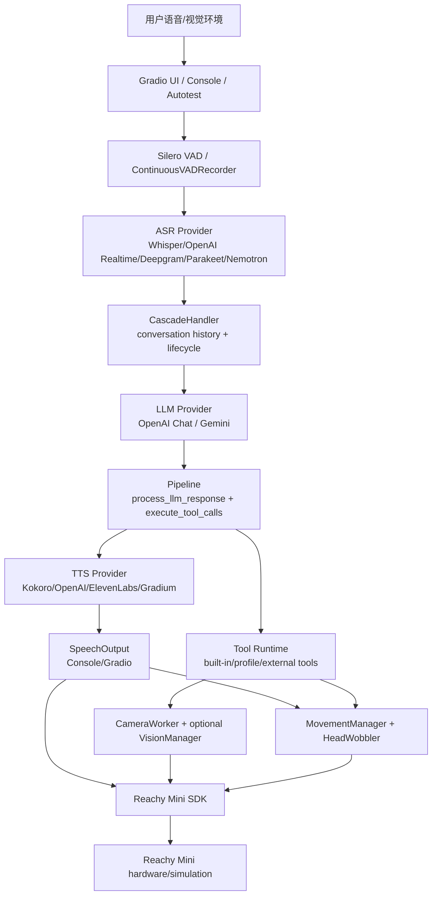

# Reachy Mini ChatBox 架构设计还原与 OHOS 迁移预研

日期：2026-04-25

范围：`roboticsreachy-mini-chatbox` 本地源码，来源为 Hugging Face Space `pollen-robotics/reachy-mini-chatbox`，通过 Hugging Face API 下载，提交号 `534b43105d74210e4a440f4bb7cd640dd440795c`。文件树记录见仓库根目录 `hf_tree.json`。

参考来源：
- Hugging Face Space：https://huggingface.co/spaces/pollen-robotics/reachy-mini-chatbox
- 本地源码根目录：`D:\wsl\peiliao\T1-reference-apps\roboticsreachy-mini-chatbox`
- 项目自带说明：`README.md`、`src/reachy_mini_conversation_app/cascade/CASCADE_CODEBASE.md`

## 1. 项目定位

Reachy Mini ChatBox 是面向 Reachy Mini 机器人的模块化语音对话应用。它继承了 `reachy_mini_conversation_app` 的机器人连接、动作控制、工具调用、profile/personality、摄像头和头部跟踪能力，但把默认对话后端从实时音频大模型改成了传统级联链路：

```text
麦克风音频 -> ASR -> LLM -> 工具调用 -> TTS -> 扬声器输出/头部动作
```

主要入口：
- 命令行入口：`reachy-mini-conversation-app = reachy_mini_conversation_app.main:main`
- Reachy Mini app 入口：`ReachyMiniConversationApp(ReachyMiniApp)`
- 默认 Cascade 入口：`src/reachy_mini_conversation_app/cascade/entry.py`
- 兼容 Realtime 入口：启动参数 `--realtime` 后仍走 `openai_realtime.py`

从迁移视角看，本项目可以拆为五层：

1. 应用启动与 profile 层：CLI、`.env`、`cascade.yaml`、profile/personality、tool 白名单。
2. Cascade 对话编排层：ASR provider、LLM provider、TTS provider、VAD、会话历史、成本统计、TurnResult。
3. 工具与机器人行为层：工具 schema、工具分发、舞蹈/表情/头部控制、实时反应。
4. 感知与媒体层：麦克风输入、扬声器输出、摄像头取帧、头部跟踪、可选本地视觉。
5. Reachy Mini SDK 适配层：机器人连接、media、pose、运动下发、动作库。

## 2. 总体运行链路



默认启动时，`main.run()` 完成 ReachyMini 连接、摄像头/视觉、MovementManager、HeadWobbler 和 ToolDependencies 初始化。若没有传入 `--realtime`，直接进入 `run_cascade_mode()`。Cascade 模式根据参数选择三种 stream manager：

| 条件 | 模式 | 主要文件 | 说明 |
| --- | --- | --- | --- |
| `--autotest` | 自动测试 | `cascade/autotest_stream.py` | 用文本脚本合成用户音频，跑完整链路 |
| `--gradio` | Web UI | `cascade/ui/gradio_app.py` | 连续 VAD 录音，聊天显示，预热音频播放 |
| 默认 | Console | `cascade/console.py` | 系统默认麦克风输入，机器人扬声器输出 |

## 3. 模块设计还原

### 3.1 启动与配置

相关文件：
- `src/reachy_mini_conversation_app/main.py`
- `src/reachy_mini_conversation_app/utils.py`
- `src/reachy_mini_conversation_app/cascade/entry.py`
- `src/reachy_mini_conversation_app/cascade/config.py`
- `cascade.yaml`

设计要点：
- `main.py` 中 Cascade 是默认路径，只有显式 `--realtime` 才回到原 OpenAI Realtime 音频到音频链路。
- CLI 增加 `--asr-provider`、`--llm-provider`、`--tts-provider`，会写入 `CASCADE_ASR_PROVIDER`、`CASCADE_LLM_PROVIDER`、`CASCADE_TTS_PROVIDER` 环境变量覆盖 `cascade.yaml`。
- `cascade.yaml` 将 provider 元数据和 provider 参数集中管理，包括 `module`、`class`、`streaming`、`location`、`requires`、`hardware`、`import_check`、`install_extra`。
- `CascadeConfig` 在加载时校验 provider 是否存在、API key 是否存在、可选依赖是否安装、硬件是否匹配。
- 当前默认配置偏向本地低成本链路：ASR=`parakeet_mlx_progressive`，LLM=`gemini-2.5-flash-lite`，TTS=`kokoro`。其中 ASR 默认要求 Apple Silicon，迁移或在 Windows/Linux 上运行时需要改成云端 provider 或 CUDA provider。

OHOS 迁移判断：
- `cascade.yaml` 的配置模型值得保留，但 OHOS 上应迁移为应用配置、设备管理配置或远端下发配置。
- Python 动态 import provider 的方式不适合 OHOS 原生化，可替换为静态 provider 注册表。
- provider 可用性校验逻辑可以保留为设计，但实现要改为 ArkTS/C++ 能识别的能力探测。

### 3.2 Cascade 对话编排层

相关文件：
- `src/reachy_mini_conversation_app/cascade/handler.py`
- `src/reachy_mini_conversation_app/cascade/pipeline.py`
- `src/reachy_mini_conversation_app/cascade/turn_result.py`
- `src/reachy_mini_conversation_app/cascade/speech_output.py`

核心职责：
- `CascadeHandler` 持有 ASR/LLM/TTS provider、会话历史、工具规格、转录分析器、成本统计、TurnResult 列表。
- `process_audio_manual()` 处理一次性录音，`process_audio_streaming_start/chunk/end()` 处理流式 ASR。
- `_run_pipeline_after_transcription()` 是 ASR 后的统一路径：添加用户消息，停止 listening 状态，触发 transcript analysis，调用 LLM pipeline，组装 TurnResult。
- `pipeline.process_llm_response()` 负责流式接收 LLM 文本和 tool call。若 LLM 只返回文本而没有调用 `speak`，会合成一个 `speak` tool call 兜底。
- `pipeline.execute_tool_calls()` 统一执行工具，并对 `speak` 和 `see_image_through_camera` 做特殊处理。`speak` 会触发 TTS 与播放，`see_image_through_camera` 会保存 JPEG 并把图像作为用户消息追加给 LLM 再分析。
- `TurnResult/TurnItem` 把 UI 展示与 conversation history 解耦，UI 只消费结构化 turn items。

OHOS 迁移判断：
- 这层是本项目最有复用价值的业务编排设计。
- Python `asyncio`、线程和 dataclass 可迁移为 ArkTS async/worker 或 native service 状态机。
- Conversation history、Tool call、TurnResult 都建议保留为稳定协议对象，方便云端/端侧混合部署。

### 3.3 Provider 抽象

相关文件：
- `src/reachy_mini_conversation_app/cascade/provider_factory.py`
- `src/reachy_mini_conversation_app/cascade/asr/*.py`
- `src/reachy_mini_conversation_app/cascade/llm/*.py`
- `src/reachy_mini_conversation_app/cascade/tts/*.py`

Provider 分层：

| 类型 | 抽象 | 当前实现 | 迁移难度 |
| --- | --- | --- | --- |
| ASR | `ASRProvider.transcribe()`、`StreamingASRProvider.start/send/partial/end` | OpenAI Whisper、OpenAI Realtime ASR、Deepgram、Parakeet MLX、Parakeet NeMo、Nemotron、Voxtral MLX | 云端中等，本地模型高 |
| LLM | `LLMProvider.generate()` 输出 `LLMChunk` | OpenAI Chat、Gemini | 中等，主要是协议适配 |
| TTS | `TTSProvider.synthesize()` 输出 PCM bytes | OpenAI TTS、Kokoro、ElevenLabs、Gradium | 云端中等，本地 Kokoro 高 |

设计要点：
- Provider 类名和模块名由 `cascade.yaml` 决定，通过 `provider_factory.init_provider()` 动态导入。
- ASR 明确区分 batch 和 streaming。streaming provider 额外暴露 partial transcript。
- LLM 层统一输出 `text_delta`、`tool_call`、`done` 三类 chunk，并由 provider 自己适配 OpenAI/Gemini 差异。
- TTS 默认采样率 24 kHz，可由 provider 覆盖。

OHOS 迁移判断：
- 云端 ASR/LLM/TTS 可以在 OHOS 端直接协议适配，也可以保留 Python 伴随服务转接。
- 本地 Parakeet MLX、Voxtral MLX、Kokoro、NeMo/Nemotron 依赖各自推理生态，不能直接移植到 OHOS，需要重新评估模型格式、推理引擎、量化和硬件。
- Provider 抽象适合迁移为统一接口，provider 实现分阶段替换。

### 3.4 VAD、音频输入与播放

相关文件：
- `src/reachy_mini_conversation_app/cascade/vad.py`
- `src/reachy_mini_conversation_app/cascade/console.py`
- `src/reachy_mini_conversation_app/cascade/ui/audio_recording.py`
- `src/reachy_mini_conversation_app/cascade/ui/audio_playback.py`
- `src/reachy_mini_conversation_app/cascade/speech_output.py`

设计要点：
- VAD 使用 Silero VAD，固定 16 kHz，512 sample chunk，约 32 ms。
- `VADStateMachine` 统一 LISTENING、RECORDING、PROCESSING 状态，并维护约 0.5 s preroll buffer。
- Console 模式使用 `sounddevice` 从系统默认麦克风录音，同时通过 `robot.media.push_audio_sample()` 给机器人扬声器播放。
- Gradio 模式使用 `ContinuousVADRecorder` 录音，`AudioPlaybackSystem` 预热播放线程和 wobbler 线程，降低 TTS 首包到播放的延迟。
- `GradioSpeechOutput` 会把文本拆成句子，多个句子的 TTS 并行生成，但用 gate event 保证播放顺序。

OHOS 迁移判断：
- VAD 状态机设计可复用，Silero 模型本身需替换为 OHOS 可运行的 VAD 能力或端侧推理引擎。
- `sounddevice`、`scipy.signal.resample`、`robot.media` 都需要替换为 OHOS Audio Kit、系统重采样或 native 音频服务。
- 预热播放线程、TTS 分句并行、音频驱动头部动作的结构值得保留。

### 3.5 工具系统与机器人动作

相关文件：
- `src/reachy_mini_conversation_app/tools/core_tools.py`
- `src/reachy_mini_conversation_app/tools/*.py`
- `src/reachy_mini_conversation_app/moves.py`
- `src/reachy_mini_conversation_app/audio/head_wobbler.py`
- `src/reachy_mini_conversation_app/dance_emotion_moves.py`

设计要点：
- `Tool` 抽象定义 `name`、`description`、`parameters_schema`、异步 `__call__`。
- `ToolDependencies` 注入 ReachyMini、MovementManager、CameraWorker、VisionManager、HeadWobbler。
- profile 的 `tools.txt` 决定可用工具，系统工具 `task_status`、`task_cancel` 自动加入。
- ChatBox 新增 `speak`、`see_image_through_camera`、`describe_camera_image` 三个更贴合 Cascade 的工具。
- `speak` 工具不直接播放音频，只返回 message，由 pipeline 中的 SpeechOutput 触发 TTS。
- `see_image_through_camera` 返回 JPEG base64，pipeline 会把大对象替换为轻量 marker 并另存帧。
- 运动层仍然由 `MovementManager` 融合主动作、语音 wobble、头部跟踪偏移后下发到 Reachy SDK。

OHOS 迁移判断：
- 工具 schema、工具白名单、工具分发是可复用设计。
- Python 动态加载 profile-local tool 和 external tool 不适合直接产品化迁移，建议改成签名插件、静态注册或远端工具服务。
- 机器人动作相关能力强依赖 Reachy Mini SDK，必须先抽象 RobotControl HAL/RPC。

### 3.6 摄像头、视觉与头部跟踪

相关文件：
- `src/reachy_mini_conversation_app/camera_worker.py`
- `src/reachy_mini_conversation_app/vision/processors.py`
- `src/reachy_mini_conversation_app/vision/yolo_head_tracker.py`
- `src/reachy_mini_conversation_app/tools/see_image_through_camera.py`
- `src/reachy_mini_conversation_app/tools/describe_camera_image.py`

设计要点：
- `utils.handle_vision_stuff()` 根据 `--no-camera`、`--head-tracker`、`--local-vision` 初始化 CameraWorker、head tracker 和 VisionManager。
- ChatBox 的 vision 目录比原工程更收敛，YOLO tracker 在 `vision/yolo_head_tracker.py`，本地视觉处理在 `vision/processors.py`。
- `describe_camera_image` 需要本地 VisionManager，若未启用 local vision，Cascade 会在工具列表中排除它。
- `see_image_through_camera` 是云端多模态路径：把相机帧给 LLM provider 作为图像上下文。

OHOS 迁移判断：
- 摄像头取帧需要替换为 OHOS Camera Kit 或机器人硬件服务。
- 本地 VLM 与 YOLO 仍属于高迁移成本算法栈。
- 图像作为 tool result 侧信道存储、再追加给 LLM 的机制可复用。

### 3.7 实时反应系统

相关文件：
- `src/reachy_mini_conversation_app/cascade/transcript_analysis/*.py`
- `src/reachy_mini_conversation_app/profiles/default/reactions.yaml`
- `src/reachy_mini_conversation_app/profiles/default/*.py`

设计要点：
- TranscriptAnalysisManager 在 ASR partial 和 final transcript 上运行，独立于主 LLM 流程。
- 支持三类触发：`words` 关键词/glob/短语，`entities` 命名实体，`all` 布尔 AND。
- 触发后异步执行 profile 中的 callback，callback 接收 `ToolDependencies`、`TriggerMatch` 和 params。
- 每个 turn 默认去重一次，repeatable entity 按实体文本去重。
- 实体识别依赖可选 GLiNER。

OHOS 迁移判断：
- 关键词和布尔触发很适合迁移到端侧，成本低。
- GLiNER 端侧迁移成本较高，可后置或替换为轻量 NER/云端 NER。
- 实时反应是 ChatBox 区别于纯 Realtime 版本的重要产品能力，建议保留。

## 4. Reachy Mini SDK 依赖清单

| 依赖 | 使用位置 | 用途 | OHOS 替换策略 |
| --- | --- | --- | --- |
| `reachy_mini.ReachyMini` | `main.py`、`console.py`、`moves.py`、`camera_worker.py` | 连接机器人、media、运动控制 | RobotControl HAL/RPC |
| `reachy_mini.ReachyMiniApp` | `main.py` | Reachy app 生命周期 | OHOS 应用生命周期 |
| `robot.client.get_status()` | `main.py` | 判断仿真模式 | 设备状态 API |
| `robot.client.disconnect()` | `main.py`、`cascade/entry.py` | 断开连接 | 资源释放 |
| `robot.media.start_recording/stop_recording` | `cascade/console.py` | 机器人媒体录制 | OHOS Audio/硬件服务 |
| `robot.media.start_playing/stop_playing/push_audio_sample` | `cascade/console.py`、`ui/audio_playback.py` | 播放 TTS 音频 | OHOS AudioRenderer 或机器人扬声器服务 |
| `robot.media.get_frame()` | `camera_worker.py` | 摄像头取帧 | OHOS Camera Kit 或硬件摄像头服务 |
| `robot.set_target/goto_target` | `moves.py` | 高频运动目标下发 | 运动控制 HAL/RPC |
| `robot.get_current_head_pose/get_current_joint_positions` | `moves.py`、`move_head.py` | 插值起点和状态读取 | 姿态/关节状态 API |
| `reachy_mini.utils.create_head_pose` | 多个动作文件 | 创建 4x4 头部 pose | 端侧数学库复刻 |
| `linear_pose_interpolation/compose_world_offset` | `moves.py`、`camera_worker.py` | pose 插值与融合 | 端侧数学库复刻 |
| `reachy_mini_dances_library` | `dance.py`、`dance_emotion_moves.py` | 舞蹈动作库 | 离线导出动作数据 |
| `RecordedMoves` | `play_emotion.py`、`dance_emotion_moves.py` | 录制表情动作 | 本地动作资源格式 |

结论：ChatBox 仍然不是可脱离 Reachy SDK 独立运行的算法库。机器人 media、pose、动作下发和动作资源都需要硬件抽象层先行。

## 5. 算法与能力依赖清单

| 能力 | 当前实现 | 是否项目自研 | 迁移建议 |
| --- | --- | --- | --- |
| ASR | OpenAI Whisper/Reatime、Deepgram、Parakeet MLX/NeMo、Nemotron、Voxtral MLX | 否，provider 编排为自研 | 云端优先，本地模型后置 |
| LLM | OpenAI Chat、Gemini | 否 | 协议适配或保留 Python 服务 |
| TTS | Kokoro、OpenAI TTS、ElevenLabs、Gradium | 否 | 云端优先，本地 Kokoro 后置 |
| VAD | Silero VAD + 本地状态机 | 模型否，状态机是 | 状态机复用，模型替换 |
| 工具调用 | LLM function calling + 本地 dispatch | 编排自研 | 保留 schema 和 dispatch |
| 实时反应 | Keyword/GLiNER + profile callback | 部分自研 | keyword 先迁移，NER 后置 |
| 语音驱动头部动作 | HeadWobbler/SpeechTapper | 是 | 建议迁移到 native service |
| 动作队列与融合 | MovementManager | 是 | 保留设计，替换 pose/HAL |
| 图像理解 | LLM 多模态或本地 VisionManager | 否 | 云端优先 |
| 头部跟踪 | YOLO 或 reachy_mini_toolbox/MediaPipe | 否 | 端侧推理栈重做 |

## 6. SDK 以外第三方依赖

### 6.1 核心依赖

| 依赖 | 作用 | OHOS 原生迁移判断 |
| --- | --- | --- |
| `gradio`、`fastrtc`、`aiortc` | Web UI 和实时音频流 | 替换为 ArkUI/WebView/系统媒体 |
| `sounddevice` | 本地麦克风和扬声器 | 替换为 OHOS Audio Kit |
| `librosa`、`scipy` | 音频解析、重采样 | 替换为系统/自研重采样 |
| `PyYAML` | 读取 `cascade.yaml` | 可替换为 JSON/YAML 解析 |
| `openai` | OpenAI ASR/LLM/TTS SDK | 直接协议适配或服务端转接 |
| `google-genai` | Gemini LLM SDK | 直接协议适配或服务端转接 |
| `huggingface-hub` | 下载模型/动作资源 | 端侧不建议依赖，改为预置或服务端 |
| `opencv-python` | JPEG 编码、图像处理 | 替换为 OHOS 图像能力 |
| `torch`、`torchaudio` | Silero/Kokoro/本地模型 | 高迁移成本 |
| `mlx-audio`、`parakeet-mlx` | Apple Silicon ASR | 不适合 OHOS |
| `nemo_toolkit` | CUDA ASR | 不适合 OHOS 端侧 |

### 6.2 Optional extras 风险

| extra | 用途 | 风险 |
| --- | --- | --- |
| `cascade` | 基础 Cascade，sounddevice/librosa/PyYAML | 中等，媒体层需替换 |
| `cascade_silero_vad` | Torch VAD | 高，端侧推理适配 |
| `cascade_parakeet_progressive`、`cascade_voxtral_mlx` | Apple Silicon 本地 ASR | 很高 |
| `cascade_nemotron` | CUDA ASR | 很高 |
| `cascade_kokoro` | 本地 TTS | 高 |
| `cascade_gemini`、`cascade_deepgram`、`cascade_elevenlabs` | 云端 provider | 中等，协议适配 |
| `local_vision`、`yolo_vision`、`mediapipe_vision` | 视觉算法 | 高 |

## 7. OHOS 迁移切分建议

第一阶段：OHOS 客户端 + Python 编排服务。
- OHOS 负责 UI、音频采集/播放、摄像头、机器人硬件桥接。
- Python 继续运行 CascadeHandler、provider、tool runtime、本地可选算法。
- 目标是最快验证 ChatBox 的低成本 provider 组合和实时反应体验。

第二阶段：迁移对话编排与工具系统。
- 把 CascadeHandler、PipelineContext、TurnResult、Tool schema、Tool dispatcher 迁入 OHOS service。
- 云端 ASR/LLM/TTS 通过协议调用。
- 移除 Gradio、sounddevice、Python 动态工具加载。

第三阶段：迁移动作与音频实时能力。
- 把 MovementManager、HeadWobbler、VADStateMachine 放入 native service 或高优先级 worker。
- 替换 Reachy SDK pose 和 media API。
- 对音频端到端延迟做单独压测。

第四阶段：评估端侧视觉和本地语音模型。
- 先迁移轻量人脸/头部跟踪。
- 本地 ASR/TTS/VLM 根据芯片算力、模型格式、内存峰值和推理延迟再决策。

## 8. 必须先抽象的接口

```text
RobotControl
  getStatus()
  getCurrentHeadPose()
  getCurrentJointPositions()
  setTarget(headPose, antennas, bodyYaw)
  gotoTarget(headPose, antennas, bodyYaw, duration)
  pushAudioSample(pcmFloat)
  startPlaying()
  stopPlaying()

AudioInput
  start(sampleRate, chunkSize)
  readChunk()
  stop()

CameraSource
  start()
  latestFrame()
  stop()

CascadeProvider
  ASR.start/send/end/transcribe()
  LLM.generate(messages, tools)
  TTS.synthesize(text)

ToolRuntime
  register(spec, executor)
  dispatch(toolCall)
  status(taskId)
  cancel(taskId)
```

## 9. 关键风险

1. 默认配置平台风险：当前默认 ASR 是 Apple Silicon 的 `parakeet_mlx_progressive`，不适合 Windows/Linux/OHOS 默认运行，需要迁移方案中明确默认云端 provider。
2. 音频实时性风险：VAD、ASR partial、TTS 首包、播放预热、头部 wobble 都影响体感延迟，OHOS 音频链路需要单独压测。
3. 本地模型生态风险：MLX、NeMo、Kokoro、Silero、GLiNER 均不是简单编译即可到 OHOS。
4. Python 动态加载风险：provider 和 external tool 都依赖动态 import，产品化需要注册、签名和权限控制。
5. 机器人 HAL 风险：没有等价的 pose、media、camera、动作资源接口时，应用无法闭环。
6. 文档与代码不一致风险：`CASCADE_CODEBASE.md` 中仍有旧参数名 `--test-file`，实际代码和 README 使用 `--autotest`。

## 10. 结论

ChatBox 的核心价值不是新增某一个模型，而是把机器人对话拆成可替换的 ASR、LLM、TTS provider，并在工具调用、实时反应、TTS 播放和动作控制之间建立了清晰边界。对 OHOS 迁移来说，最值得保留的是 Cascade 编排、Tool schema、TurnResult、VAD 状态机、SpeechOutput 抽象、动作融合设计；最需要替换的是 Python 媒体栈、Reachy SDK、动态插件、本地模型推理栈和 Web UI。

推荐迁移路线：先做“OHOS 客户端 + Python Cascade 服务 + 机器人 HAL”的验证版，再逐步端侧化对话编排和动作控制，最后评估本地 ASR/TTS/VLM。
